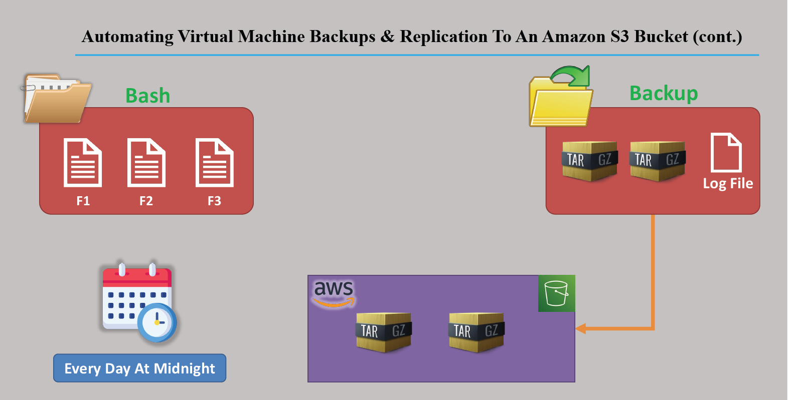
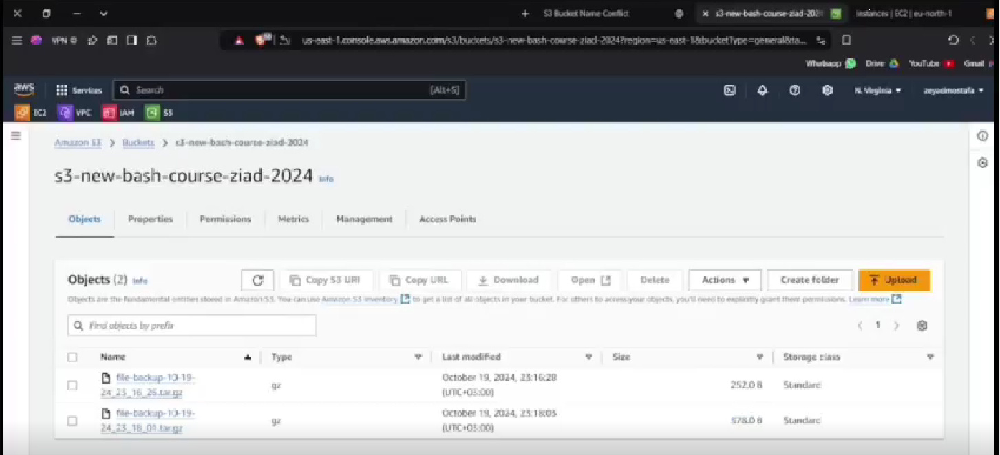

# 🧪 VM Backup & Replication to Amazon S3 using Bash Script

This is my Capstone Project that automates backing up files from a Virtual Machine and uploads them to an Amazon S3 bucket using a Bash script and scheduling.

---

## 🚀 Project Overview

This project includes a Bash script that:
- Compresses a folder from the VM
- Saves it as a `.tar.gz` file with a timestamp
- Uploads it to an S3 bucket
- Logs all actions to a log file

You can also schedule the script to run automatically using `cron`.

---

## 🔧 Key Features

- **Backup Scheduling**: Automate backups every 2 minutes (or any interval using cron)
- **Compression**: Files are compressed to save storage using `tar`
- **S3 Upload**: Files are uploaded to Amazon S3 using AWS CLI
- **Logging**: All events and errors are saved in a log file for tracking

---

## 🛠️ Prerequisites

- AWS CLI installed on the VM
- IAM role or user with S3 permissions (`AmazonS3FullAccess`)
- A created S3 bucket
- Linux environment (e.g., EC2 instance)

---

## 📦 Folder Structure

bash-vm-backup-to-s3/ ├── backup-script.sh # Main bash script ├── crontab.txt # Cron schedule example ├── images/ │ └── architecture.png # Project diagram └── README.md # This file

yaml

---

## 📸 Project Diagram

### Architecture Overview



### Result Overview



---

## 🕐 Automation Example (cron)

To schedule the backup every 2 minutes:

```bash
*/2 * * * * root /home/ubuntu/backup-script.sh
